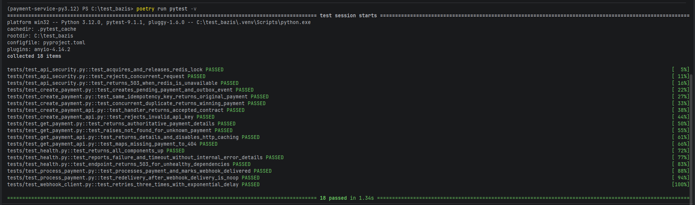

# Асинхронный сервис процессинга платежей

Микросервис принимает платежи через FastAPI, сохраняет событие в Outbox,
асинхронно передаёт его в RabbitMQ, эмулирует обработку платежа и уведомляет
клиента через webhook.

## Возможности

- создание платежа с защитой по `Idempotency-Key`;
- получение актуального статуса платежа;
- статическая авторизация через `X-API-Key`;
- атомарное сохранение платежа и Outbox-события в PostgreSQL;
- публикация событий в очередь `payments.new`;
- один consumer с эмуляцией обработки 2-5 секунд и вероятностью успеха 90%;
- отправка webhook через `aiohttp`;
- три попытки webhook с экспоненциальной задержкой;
- quorum queue с тремя попытками доставки и `payments.dlq`;
- Redis lock для защиты от конкурентной обработки одинакового ключа;
- healthcheck PostgreSQL, Redis и RabbitMQ;
- автоматическое применение Alembic-миграций при запуске Docker Compose.

## Архитектура обработки

1. `POST /api/v1/payments` проверяет `X-API-Key` и захватывает Redis lock для
   нормализованного `Idempotency-Key`.
2. Платёж и событие `payment.created` записываются в PostgreSQL одной
   транзакцией.
3. Outbox Publisher выбирает pending-события через
   `FOR UPDATE SKIP LOCKED` и публикует persistent-сообщения в `payments.new`.
4. После подтверждения RabbitMQ запись Outbox получает статус `processed`.
5. Consumer эмулирует платёжный шлюз и сохраняет `succeeded` или `failed`.
6. Результат отправляется на `webhook_url`. Успешная доставка сохраняется в
   `webhook_delivered_at`.
7. Необработанное сообщение возвращается в quorum queue через
   `basic.reject(requeue=True)`. После трёх попыток RabbitMQ перемещает его в
   `payments.dlq`.

PostgreSQL является окончательной гарантией идемпотентности. Redis используется
только для последовательной обработки одновременно поступивших запросов.

## Запуск через Docker Compose

Создайте `.env` на основе примера:

```bash
cp .env_example .env
```

В PowerShell:

```powershell
Copy-Item .env_example .env
```

При необходимости измените пароли и `API_KEY`, затем запустите проект:

```bash
docker compose up --build
```

Порядок запуска контролируется Docker Compose:

1. запускаются PostgreSQL, RabbitMQ и Redis;
2. после готовности PostgreSQL одноразовый сервис `migrations` выполняет
   `alembic upgrade head`;
3. только после успешного завершения миграций запускаются API и consumer;
4. тесты автоматически не запускаются.

Проверить состояние сервисов:

```bash
docker compose ps
docker compose logs migrations
```

После запуска доступны:

- API: `http://localhost:8000`;
- Swagger UI: `http://localhost:8000/inspection/docs`;
- RabbitMQ Management: `http://localhost:15672`.

Учётные данные и порты задаются в `.env`.

## Создание платежа

```bash
curl -X POST http://localhost:8000/api/v1/payments \
  -H "Content-Type: application/json" \
  -H "X-API-Key: super-secret-api-key" \
  -H "Idempotency-Key: order-42" \
  -d '{
    "amount": "1500.00",
    "currency": "RUB",
    "description": "Order 42",
    "metadata": {"order_id": 42},
    "webhook_url": "https://merchant.example/webhooks/payments"
  }'
```

Ответ `202 Accepted`:

```json
{
  "payment_id": "c3541913-e62a-4901-a69d-d5786fcf4e2d",
  "status": "pending",
  "created_at": "2026-08-04T10:00:00Z"
}
```

## Получение платежа

```bash
curl http://localhost:8000/api/v1/payments/<payment_id> \
  -H "X-API-Key: super-secret-api-key"
```

Эндпоинт возвращает сумму, валюту, описание, метаданные, статус, webhook URL и
временные метки создания, обработки и доставки webhook. Ответ запрещено
кешировать через `Cache-Control: no-store`.

## Webhook

Пример тела уведомления:

```json
{
  "payment_id": "b8ed4801-e990-4be9-af28-2529f2fb3388",
  "status": "succeeded",
  "processed_at": "2026-08-04T10:00:03Z"
}
```

Запрос содержит заголовок:

```text
Idempotency-Key: payment-result:<payment_id>
```

## Healthcheck

```bash
curl http://localhost:8000/health \
  -H "X-API-Key: super-secret-api-key"
```

Проверяются API, PostgreSQL, Redis и RabbitMQ. При доступности всех компонентов
возвращается `200`, при отказе любой зависимости — `503`. Внутренние тексты
ошибок наружу не передаются.

## Миграции

При обычном запуске Docker Compose миграции применяются автоматически отдельным
сервисом `migrations`. Для ручного запуска:

```bash
docker compose run --rm migrations
```

Создание новой миграции при локальной разработке:

```bash
poetry run alembic revision --autogenerate -m "описание изменения"
```

## Тесты

Тесты не запускаются автоматически вместе с контейнерами. Установите test-группу
зависимостей и запустите pytest вручную:

```bash
poetry install --with test
poetry run pytest -v
```

Текущий набор содержит 18 тестов, проверяющих API, use cases, Redis lock,
идемпотентность, обработку платежа, webhook retry и healthcheck.


